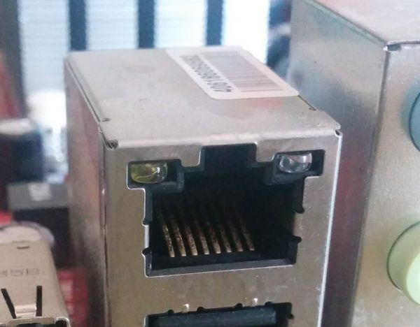

<h1>Placa Base</h1>

<h1>Partes</h1>

<ol>
<h1><li>Procesador</h1></li>
<h2>Es el núcleo del ordenador, responsable de llevar a cabo las instrucciones del sistema operativo y los programas informáticos. Ejecuta cálculos y administra procesos esenciales.</h2>

<h1><li>Xipset</h1></li>
<h2>Históricamente, administraba la comunicación a gran velocidad entre el procesador, la memoria RAM y la tarjeta de video. Actualmente, sus funciones se encuentran incorporadas en la CPU de muchos sistemas actuales.</h2>

<h1><li>Ranuras de memoria Ram</h1></li>
<h2>Es el lugar en el que se colocan los módulos de memoria RAM. Facilitan a la CPU el acceso inmediato a datos temporales.</h2>

<h1><li>Bios</h1></li>
<h2>Es un dispositivo de firmware que guarda el software indispensable para poner en marcha el equipo y cargar el sistema operativo.</h2>

<h1><li>Ranuras de expansiión</h1></li>
<h2>Son conectores que permiten el montaje de tarjetas extra que amplían las capacidades del sistema.</h2>

<h1><li>Conectores fuente de alimentación</h1></li>
<h2>Facilitan la entrada de energía eléctrica a la placa base a traves de la fuente de alimentación</h2>

<h1><li>Puertos de almacenaje</h1></li>
<h2>SATA: Incorpora discos duros y SSD convencionales. Proporciona velocidades hasta 6 Gbps.
NVMe: Los protocolos aplicados a unidades SSD en ranuras M.2 o PCIe, proporcionan velocidades notablemente superiores al emplear canales PCIe directos.</h2>

<h1><li>Puertos de Red Ethernet</h1></li>
<h2>Facilita el enlace físico a redes a través de un cable LAN. Normalmente soporta velocidades de 1 Gbps o superiores.</h2>

<h1><li>Conectores internos y externos</h1></li>
<h2>Para dispositivos periféricos como teclados, ratones, discos externos. Ademas de entradas HDMI, HD Audio, etc.</h2>

<h1><li>Pila de la BIOS</h1></li></ul>
<h2>Conserva las configuraciones de la BIOS/UEFI (como el cronómetro del sistema y las modificaciones de hardware) cuando el dispositivo se encuentra en silencio y se ha desvinculado de la fuente de energía.</h2>

